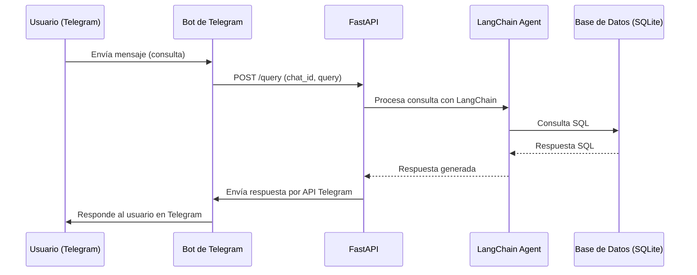

# Data Agent con FastAPI, SQLite, LangChain y Telegram

Este proyecto implementa un agente de IA que responde consultas en lenguaje natural sobre una base de datos SQLite dummy, y responde a través de Telegram.

## Estructura

- **src/main/bot.py**: Script que realiza un poll de Telegram para obtener las novedades del bot y envía el request al endpoint `/query`
- **src/main/main.py**: Servidor FastAPI con endpoint `/query` que procesa consultas en lenguaje natural y responde vía Telegram.
- **src/db/chinook.db**: Base de datos dummy.
- **requirements.txt**: Dependencias necesarias.


## Requisitos
- Python 3.10-slim
- Docker
- Variables de entorno:
  - `OPENAI_API_KEY`: Tu API key de OpenAI
  - `TELEGRAM_BOT_TOKEN`: Token de tu bot de Telegram
  - `MODEL_OPEN_AI`: Modelo de open ai a utilizar
  - `LANGSMITH_TRACING`: false #cambiar a true si se desea trackear con langsmith
  - `LANGSMITH_ENDPOINT`: "https://api.smith.langchain.com"
  - `LANGSMITH_API_KEY`: "tu_api_key"
  - `LANGSMITH_PROJECT`: "nombre_del_proyecto"

Las variables de langsmith no son necesarias para correr la app

## Instalación y uso con Docker

1. **Crear un arhcivo .env:**

Copiar el .env example y llamarlo .env
Poner las api_keys correspondientes

2. **Construir la imagen Docker:**

```bash
docker build -t data-agent .
```

3. **Correr el contenedor:**

```bash
docker run --env-file .env -p 8000:8000 data-agent

```

3. **Probar el endpoint desde telegram:**

Enviar un mensaje al bot por telegram

## Integración con Telegram

Se realiza un poll para obtener las novedades del bot,

El agente procesa la consulta, consulta la base SQLite y responde al chat de Telegram usando la API oficial.

## Notas
- El modelo de OpenAI usado por defecto es gpt-4o.mini (puedes cambiarlo con la variable de entorno `MODEL_OPEN_AI`).

## Diagrama de flujo de la aplicación


```
