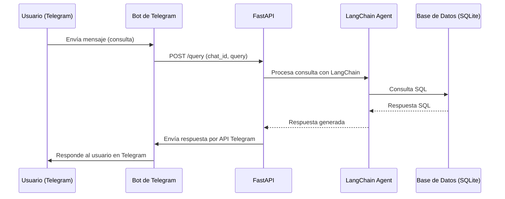

# Data Agent con FastAPI, SQLite, LangChain y Telegram

Este proyecto implementa un agente de IA que responde consultas en lenguaje natural sobre una base de datos SQLite dummy, y responde a través de Telegram.

## Estructura

- **src/main/main.py**: Servidor FastAPI con endpoint `/query` que procesa consultas en lenguaje natural y responde vía Telegram.
- **requirements.txt**: Dependencias necesarias.
- **example_telegram_post.sh**: Ejemplo de cómo probar el endpoint localmente.

## Requisitos
- Python 3.9+ (solo si corres fuera de Docker)
- Docker (recomendado)
- Variables de entorno:
  - `OPENAI_API_KEY`: Tu API key de OpenAI
  - `TELEGRAM_BOT_TOKEN`: Token de tu bot de Telegram
  - `MODEL_OPEN_AI`: Modelo de open ai a utilizar

## Instalación y uso con Docker

1. **Crear un arhcivo .env:**

Copiar el .env example y llamrlo .env
Poner las api_keys correspondientes

2. **Construir la imagen Docker:**

```bash
docker build -t data-agent .
```

3. **Correr el contenedor:**

```bash
docker run --env-file .env -p 8000:8000 data-agent

```

3. **Probar el endpoint desde telegram:**

Enviar un mensaje al bot por telegram

## Integración con Telegram

El endpoint `/query` espera un JSON con:
- `query`: Consulta en lenguaje natural
- `chat_id`: ID del chat de Telegram donde responder

El agente procesa la consulta, consulta la base SQLite y responde al chat de Telegram usando la API oficial.

## Notas
- El modelo de OpenAI usado por defecto es gpt-4o.mini (puedes cambiarlo con la variable de entorno `MODEL_OPEN_AI`).

## Diagrama de flujo de la aplicación


```

## Notas
- El modelo de OpenAI usado por defecto es gpt-4o.mini (puedes cambiarlo con la variable de entorno `MODEL_OPEN_AI`).
